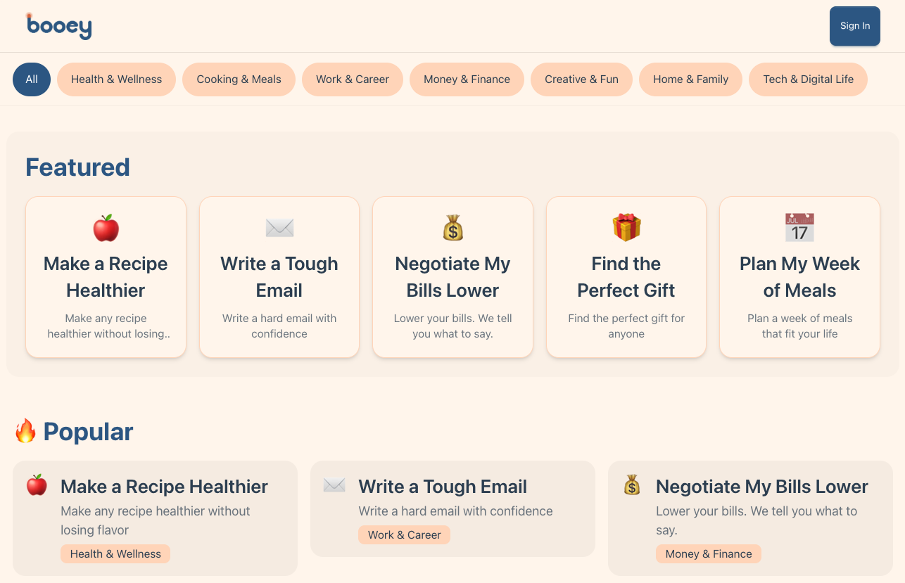
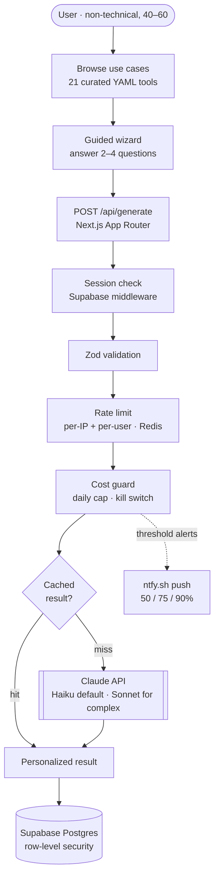

# Booey

**Guided AI tools for everyday people — no blank chatbot, no prompt engineering.** A retired weekend project (Feb–Apr 2026): built, shipped to [booey.ai](https://booey.ai), and retired. This repo is archived for reference. _(The "Booey" brand later moved to a different project, which is why this one lives on as its history.)_

---

## The idea

Most people know AI exists but freeze at a blank chat box — they don't know what to type, and "prompt engineering" is a non-starter. Booey removed the blank page entirely.

Instead of a cursor, users got a shelf of **curated use cases** — "Make this recipe healthier," "Negotiate a bill," "Check if this is a scam" — clicked one, answered **2–4 guided questions**, and got a **personalized result**. No jargon, no model picker, no empty prompt.

- **Who it was for:** non-technical adults, roughly 40–60 — people who'd heard of AI but never reached for it. Every design choice (large touch targets, 16px+ type, plain language, one-tap Google sign-in) followed from that.
- **The thesis:** the barrier to everyday AI isn't capability, it's the blank-canvas UX. Show people concrete, outcome-shaped tasks and the value becomes obvious.
- **The shape:** 21 curated tools across four categories (health, work, lifestyle, personal), each defined declaratively as a YAML file with its own guided questions and system prompt.

## Screenshots

<!-- TODO: add real screenshots from the live booey.ai era. Drop images in docs/screenshots/ and replace the placeholders below. -->

| Browse use cases | Guided wizard | Personalized result |
|:---:|:---:|:---:|
| _screenshot coming soon_ | _screenshot coming soon_ | _screenshot coming soon_ |
| <!--  --> | <!--  --> | <!--  --> |

## Architecture



| Layer | Technology |
|-------|-----------|
| Framework | Next.js 16 (App Router) + TypeScript |
| Styling | Tailwind CSS + DaisyUI (mobile-first) |
| Auth & DB | Supabase (Postgres + Google OAuth), row-level security |
| AI | Anthropic Claude — Haiku by default, Sonnet for complex use cases |
| Rate limiting & budget | Upstash Redis |
| Hosting | Vercel |

→ Deeper dives: [`docs/ARCHITECTURE.md`](docs/ARCHITECTURE.md) · [`docs/OVERVIEW.md`](docs/OVERVIEW.md) · full doc index in [`docs/README.md`](docs/README.md)

## Engineering highlights

- **Cost-protection layer.** A single-founder AI app can be bankrupted by a bad day of traffic, so spend was guarded in depth: every `/api/generate` call priced its token usage against a **daily budget cap** (over-budget → `429`), an **`EMERGENCY_STOP` kill switch** to halt all AI calls instantly, and **[ntfy.sh](https://ntfy.sh) push alerts** at 50/75/90% of budget — plus per-IP and per-user rate limits. See [`docs/COST-MODEL.md`](docs/COST-MODEL.md).
- **RLS-based auth model.** Supabase Row Level Security enforces per-user data isolation at the database, not just the app layer — API routes run behind session-checking middleware, and policies use the `(select auth.uid())` pattern for per-row performance. See [`docs/infrastructure/SUPABASE.md`](docs/infrastructure/SUPABASE.md).
- **Prompt templating for use cases.** Each use case is a YAML file (validated by a Zod schema) whose `systemPrompt` composes with a shared global prompt at runtime, so tools stay consistent in tone and formatting while varying only in expertise. The authoring standard is documented in [`docs/USE-CASE-PROMPT-TEMPLATE.md`](docs/USE-CASE-PROMPT-TEMPLATE.md).
- **Response caching** (Anthropic prompt caching + a Supabase cache table) and a **type-safe question framework** — a dozen guided input types rendered from declarative YAML.

## How this was built

Booey was built as an **AI-assisted development** experiment as much as a product:

- **[Claude Code](https://www.anthropic.com/claude-code)** handled much of the implementation, working in git worktrees against task specs — the 165-commit history (Feb–Apr 2026) preserves its `Co-Authored-By: Claude` trailers, kept deliberately as a record of the workflow.
- **[v0](https://v0.dev)** was used for early UI exploration (the security headers in `next.config.ts` still make room for its embedded preview).
- Guardrails that made agent-driven development safe are checked in: strict TypeScript with enforced import boundaries (`types → lib → hooks → components → app`), a parallel lint/typecheck/test/build CI pipeline, review guidelines in [`AGENTS.md`](AGENTS.md), and reusable project skills in [`.claude/skills/`](.claude/skills/).

## Running it locally

> **Heads up:** the live Supabase project and Vercel deployment have been retired, so the app no longer runs against real backends. You can install, build, typecheck, lint, and run the unit tests with placeholder env values — that's the verification bar for this archived repo.

```bash
npm install
cp .env.example .env.local   # placeholder values are fine for the checks below

npm run lint         # ESLint (incl. import-boundary rules)
npm run typecheck    # tsc --noEmit
npm test             # Vitest (28 unit tests)
npm run build        # Next.js production build
```

`npm run dev` will boot the UI at `localhost:3000`, but flows that call Supabase or Claude need real credentials.

## Repo layout

```
src/
├── app/          # Pages + API routes (home, explore, history, privacy, terms)
├── components/   # UI (wizard/, explore/, nav/, auth/)
├── hooks/        # useUser, useTryBeforeSignup
├── lib/          # ai/, supabase/, budget, rate-limit, validation, utils/
├── data/         # use-cases/*.yaml + Zod schema
└── types/        # shared TypeScript types
docs/             # architecture, cost model, ADRs, ops runbooks (see docs/README.md)
supabase/         # SQL migrations (RLS, indexes, response cache)
```

## License

MIT.
