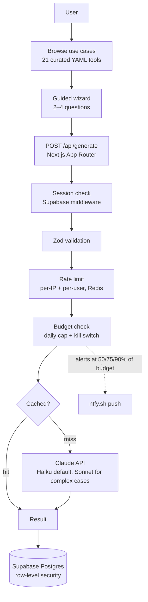

# Booey

Guided AI tools for people who freeze at a blank chatbot. Built solo over the Presidents' Day long weekend in 2026, first commit Saturday afternoon, shipped to [booey.ai](https://booey.ai), then retired. This repo is the archive. (The "Booey" name later got reused for a different project, which is why this one lives here as history.)

## The idea

My parents' generation knows AI exists. They just don't use it, because the entry point is a blank text box and a blinking cursor, and nobody wakes up thinking "I should prompt-engineer my way to a better recipe."

So: no blank box. You browse a shelf of concrete tasks — "make this recipe healthier," "negotiate a bill," "is this a scam?" — pick one, answer 2–4 plain-language questions, and get a personalized result. No prompts to write, no model picker, nothing to configure.

The catalog ended up at 21 use cases across four categories (health, work, lifestyle, personal). Each one is a YAML file, guided questions plus a system prompt, validated by a Zod schema. Everything else was built for the audience: big touch targets, 16px+ type, one-tap Google sign-in.

## Screenshots

**The catalog.** Browse concrete tasks and pick one.

<p align="center">
  
</p>

**The wizard.** Each tool asks 2–4 plain-language questions.

<p align="center">
  
</p>

**The result.** Here, a scam check with a plain-English verdict and what to do next.

<p align="center">
  
</p>

## How it worked



The stack: Next.js 16 (App Router) + TypeScript, Tailwind + DaisyUI, Supabase (Postgres + Google OAuth) with row-level security, Claude (Haiku by default, Sonnet where it earned its keep), Upstash Redis for rate limiting and budget tracking, Vercel.

Deeper dives in [`docs/ARCHITECTURE.md`](docs/ARCHITECTURE.md) and [`docs/OVERVIEW.md`](docs/OVERVIEW.md); full index at [`docs/README.md`](docs/README.md).

## The parts that were actually interesting

**Not waking up to a giant API bill.** Solo project, my card on the Anthropic account, so I was paranoid about a runaway loop or a bad night of traffic. Every `/api/generate` call prices its token usage against a daily budget cap (over budget → 429), there's an `EMERGENCY_STOP` env var that halts all AI calls instantly, and [ntfy.sh](https://ntfy.sh) pushed alerts to my phone at 50/75/90% of budget. Per-IP and per-user rate limits on top. The math behind the caps is in [`docs/COST-MODEL.md`](docs/COST-MODEL.md).

**Auth enforced in the database, not just the app.** Supabase row-level security handles per-user data isolation at the Postgres layer, so a bug in application code can't leak someone else's data. API routes sit behind session-checking middleware as the first line.

**Use cases as data, not code.** Each tool is declarative YAML — questions plus a system prompt that composes with a shared global prompt at runtime. All 21 tools stay consistent in tone and formatting and differ only in expertise, and adding one is a file, not a feature.

Also in there: response caching (Anthropic prompt caching plus a Supabase cache table) and a type-safe question framework, about a dozen guided input types rendered straight from the YAML.

## How it was built

Mostly by directing AI agents, which was half the point of the project and the reason a long weekend was enough to go from empty repo to a deployed product with 21 tools, auth, rate limiting, and budget controls. [Claude Code](https://www.anthropic.com/claude-code) did much of the implementation; the 165-commit history keeps its `Co-Authored-By: Claude` trailers on purpose, as a record of the workflow. [v0](https://v0.dev) handled early UI exploration.

What made that workable was the guardrails, all checked in: strict TypeScript with enforced import boundaries (`types → lib → hooks → components → app`), a parallel lint/typecheck/test/build CI pipeline, review guidelines in [`AGENTS.md`](AGENTS.md), and reusable project skills in [`.claude/skills/`](.claude/skills/). The agents wrote a lot of the code; the constraints kept it coherent.

## Running it

The live Supabase and Vercel are gone, so it doesn't run against real backends anymore. What still works — and what I consider the verification bar for this archive:

```bash
npm install
cp .env.example .env.local   # placeholder values are fine for these

npm run lint         # ESLint, incl. import-boundary rules
npm run typecheck    # tsc --noEmit
npm test             # 28 unit tests (budget, rate-limit, use-cases)
npm run build        # Next.js production build
```

`npm run dev` boots the UI at `localhost:3000`, but anything touching Supabase or Claude needs real credentials you can no longer get from me.

## Repo layout

```
src/
├── app/          # Pages + API routes
├── components/   # UI (wizard/, explore/, nav/, auth/)
├── hooks/        # useUser, useTryBeforeSignup
├── lib/          # ai/, supabase/, budget, rate-limit, validation
├── data/         # use-cases/*.yaml + Zod schema
└── types/        # shared TypeScript types
docs/             # architecture, cost model, ADRs (see docs/README.md)
supabase/         # SQL migrations (RLS, indexes, response cache)
```

## License

MIT.
